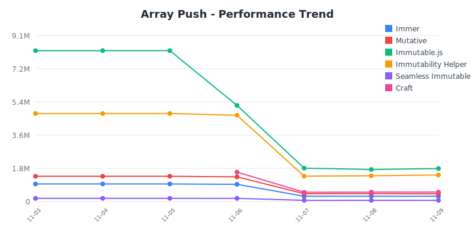
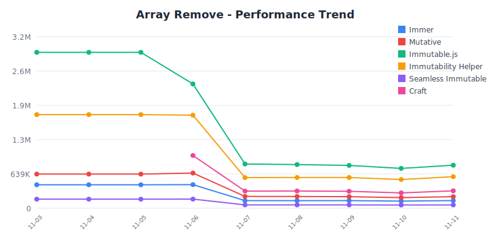
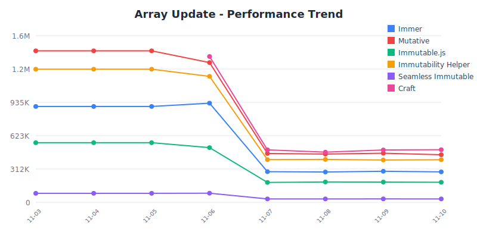
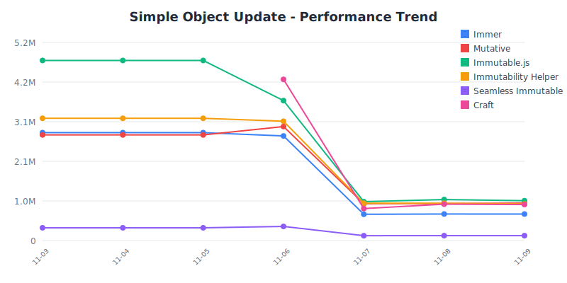

# State Management Benchmark 🏆

Professional performance comparison of JavaScript state management libraries.

## 📋 Benchmark Information

- **Last Updated:** January 1, 2025
- **Last Run:** 12:00:00 AM UTC
- **Environment:** Node.js v25.0.0, darwin arm64
- **Test Framework:** Vitest Bench
- **Iterations:** 3 runs averaged for statistical accuracy

## 📦 Library Versions

| Library | Version | Size (gzip) | Last Updated |
|---------|---------|-------------|-------------|
| **[@sylphx/craft](https://github.com/sylphxltd/craft)** | `v1.2.1` | 2.76KB | Nov 6, 2025 |
| **[immer](https://github.com/immerjs/immer)** | `v10.1.1` | 4.70KB | Nov 6, 2025 |
| **[immutability-helper](https://github.com/kolodny/immutability-helper)** | `v3.1.1` | 1.65KB | Nov 6, 2025 |
| **[immutable](https://github.com/immutable-js/immutable-js)** | `v4.3.7` | 17.74KB | Nov 6, 2025 |
| **[mutative](https://github.com/unadlib/mutative)** | `v1.1.1` | N/A | Nov 6, 2025 |
| **[seamless-immutable](https://github.com/rtfeldman/seamless-immutable)** | `v7.1.4` | 2.71KB | Nov 6, 2025 |

## 📦 Bundle Size Comparison

Smaller bundle sizes mean faster initial load times and better user experience.

| Rank | Library | Minified + Gzipped | Minified | Relative to Smallest |
|------|---------|-------------------|----------|---------------------|
| 🥇 | **[immutability-helper](https://github.com/kolodny/immutability-helper)** | 1.65KB | 4.68KB | Baseline |
| 🥈 | **[seamless-immutable](https://github.com/rtfeldman/seamless-immutable)** | 2.71KB | 7.55KB | 1.64x |
| 🥉 | **[@sylphx/craft](https://github.com/sylphxltd/craft)** | 2.76KB | 9.56KB | 1.67x |
| 📍 | **[immer](https://github.com/immerjs/immer)** | 4.70KB | 13.83KB | 2.84x |
| 📍 | **[immutable](https://github.com/immutable-js/immutable-js)** | 17.74KB | 65.04KB | 10.73x |

**Size Insight:** immutability-helper is the most lightweight at 1.65KB (gzip), while immutable is 10.73x larger at 17.74KB (gzip).

## 🏆 Top Performers

Quick overview of category winners (libraries only):

| Category | 🥇 Winner | Ops/sec | Runner-up |
|----------|-----------|---------|----------|
| **Simple Object Update** | [Immutable.js](https://github.com/immutable-js/immutable-js) | 4.79M | [Craft](https://github.com/sylphxltd/craft) (4.35M) |
| **Nested Object Update** | [Immutability Helper](https://github.com/kolodny/immutability-helper) | 1.54M | [Craft](https://github.com/sylphxltd/craft) (1.29M) |
| **Array Push** | [Immutable.js](https://github.com/immutable-js/immutable-js) | 7.90M | [Immutability Helper](https://github.com/kolodny/immutability-helper) (4.78M) |
| **Array Remove** | [Immutable.js](https://github.com/immutable-js/immutable-js) | 2.80M | [Immutability Helper](https://github.com/kolodny/immutability-helper) (1.74M) |
| **Array Update** | [Craft](https://github.com/sylphxltd/craft) | 1.54M | [Mutative](https://github.com/unadlib/mutative) (1.37M) |
| **Deep Nested Update (5 levels)** | [Immutability Helper](https://github.com/kolodny/immutability-helper) | 871.23K | [Craft](https://github.com/sylphxltd/craft) (684.92K) |
| **Large Array Update (1000 items)** | [Mutative](https://github.com/unadlib/mutative) | 1.11M | [Immer](https://github.com/immerjs/immer) (80.40K) |
| **Multiple Updates (3 changes)** | [Immutability Helper](https://github.com/kolodny/immutability-helper) | 823.05K | [Craft](https://github.com/sylphxltd/craft) (673.52K) |

## 📜 Historical Results

Track performance changes over time:

| Date | Results | Notes |
|------|---------|-------|
| 2025-11-06 | [View Results](./results/2025-11-06.json) | Benchmark run |
| 2025-11-05 | [View Results](./results/2025-11-05.json) | Benchmark run |
| 2025-11-04 | [View Results](./results/2025-11-04.json) | Benchmark run |
| 2025-11-03 | [View Results](./results/2025-11-03.json) | Benchmark run |

> 💡 **Tip:** Compare historical results to track performance improvements or regressions over time.

### 📈 Performance Trends

Visual representation of performance over time:

**Array Push**



**Array Remove**



**Array Update**



<details>
<summary>View 2 more trend charts</summary>

**Nested Object Update**


**Simple Object Update**



</details>

## 📊 Detailed Results

### Simple Object Update

**Performance Comparison:**

```
🥇 Immutable.js         ████████████████████████████████████████ 4.79M
🥈 Craft                ████████████████████████████████████ 4.35M
🥉 Immutability Helper  ███████████████████████████ 3.22M
📍 Mutative             █████████████████████████ 2.97M
📍 Immer                ███████████████████████ 2.73M
📍 Seamless Immutable   ███ 371.74K
```

| Rank | Library | Ops/sec | Variance | Mean | p99 | Samples |
|------|---------|---------|----------|------|-----|--------|
| 🥇 | **Native Spread** | 45.03M | ±1.62% | 0.0222ms | 0.0420ms | 22.52M |
| 🥈 | **[Immutable.js](https://github.com/immutable-js/immutable-js)** | 4.79M | ±0.21% | 0.2088ms | 0.2910ms | 2.39M |
| 🥉 | **[Craft](https://github.com/sylphxltd/craft)** | 4.35M | ±1.17% | 0.2298ms | 0.2920ms | 2.18M |
| 📍 | **[Immutability Helper](https://github.com/kolodny/immutability-helper)** | 3.22M | ±0.21% | 0.3103ms | 0.4160ms | 1.61M |
| 📍 | **[Mutative](https://github.com/unadlib/mutative)** | 2.97M | ±2.63% | 0.3366ms | 0.4170ms | 1.49M |
| 📍 | **[Immer](https://github.com/immerjs/immer)** | 2.73M | ±1.02% | 0.3661ms | 0.5420ms | 1.37M |
| 📍 | **[Seamless Immutable](https://github.com/rtfeldman/seamless-immutable)** | 371.74K | ±2.36% | 2.6900ms | 3.2500ms | 185.87K |

**Key Insight:** Native Spread is **121.14x faster** than Seamless Immutable in this category.

### Nested Object Update

**Performance Comparison:**

```
🥇 Immutability Helper  ████████████████████████████████████████ 1.54M
🥈 Craft                ██████████████████████████████████ 1.29M
🥉 Mutative             ███████████████████████████████ 1.21M
📍 Immutable.js         █████████████████ 675.65K
📍 Immer                ████████████████ 623.56K
📍 Seamless Immutable   ███ 105.60K
```

| Rank | Library | Ops/sec | Variance | Mean | p99 | Samples |
|------|---------|---------|----------|------|-----|--------|
| 🥇 | **Native Spread** | 36.31M | ±0.11% | 0.0275ms | 0.0420ms | 18.15M |
| 🥈 | **[Immutability Helper](https://github.com/kolodny/immutability-helper)** | 1.54M | ±0.39% | 0.6474ms | 0.8330ms | 772.32K |
| 🥉 | **[Craft](https://github.com/sylphxltd/craft)** | 1.29M | ±0.42% | 0.7725ms | 1.0000ms | 647.27K |
| 📍 | **[Mutative](https://github.com/unadlib/mutative)** | 1.21M | ±0.48% | 0.8240ms | 1.0420ms | 606.77K |
| 📍 | **[Immutable.js](https://github.com/immutable-js/immutable-js)** | 675.65K | ±1.77% | 1.4801ms | 1.8750ms | 337.82K |
| 📍 | **[Immer](https://github.com/immerjs/immer)** | 623.56K | ±0.43% | 1.6037ms | 2.0000ms | 311.78K |
| 📍 | **[Seamless Immutable](https://github.com/rtfeldman/seamless-immutable)** | 105.60K | ±0.45% | 9.4699ms | 13.5420ms | 52.80K |

**Key Insight:** Native Spread is **343.82x faster** than Seamless Immutable in this category.

### Array Push

**Performance Comparison:**

```
🥇 Immutable.js         ████████████████████████████████████████ 7.90M
🥈 Immutability Helper  ████████████████████████ 4.78M
🥉 Craft                ████████ 1.52M
📍 Mutative             ███████ 1.34M
📍 Immer                ████ 849.80K
📍 Seamless Immutable   █ 152.42K
```

| Rank | Library | Ops/sec | Variance | Mean | p99 | Samples |
|------|---------|---------|----------|------|-----|--------|
| 🥇 | **Native Spread** | 37.35M | ±0.24% | 0.0268ms | 0.0420ms | 18.68M |
| 🥈 | **[Immutable.js](https://github.com/immutable-js/immutable-js)** | 7.90M | ±1.06% | 0.1266ms | 0.2500ms | 3.95M |
| 🥉 | **[Immutability Helper](https://github.com/kolodny/immutability-helper)** | 4.78M | ±0.26% | 0.2093ms | 0.2500ms | 2.39M |
| 📍 | **[Craft](https://github.com/sylphxltd/craft)** | 1.52M | ±0.85% | 0.6574ms | 0.8330ms | 760.55K |
| 📍 | **[Mutative](https://github.com/unadlib/mutative)** | 1.34M | ±0.87% | 0.7446ms | 0.9580ms | 671.54K |
| 📍 | **[Immer](https://github.com/immerjs/immer)** | 849.80K | ±1.05% | 1.1768ms | 1.7920ms | 424.90K |
| 📍 | **[Seamless Immutable](https://github.com/rtfeldman/seamless-immutable)** | 152.42K | ±1.67% | 6.5607ms | 19.5830ms | 76.21K |

**Key Insight:** Native Spread is **245.06x faster** than Seamless Immutable in this category.

### Array Remove

**Performance Comparison:**

```
🥇 Immutable.js         ████████████████████████████████████████ 2.80M
🥈 Immutability Helper  █████████████████████████ 1.74M
🥉 Craft                ██████████████ 964.88K
📍 Mutative             █████████ 646.00K
📍 Immer                ██████ 424.68K
📍 Seamless Immutable   ██ 169.82K
```

| Rank | Library | Ops/sec | Variance | Mean | p99 | Samples |
|------|---------|---------|----------|------|-----|--------|
| 🥇 | **Native Filter** | 40.65M | ±0.40% | 0.0246ms | 0.0420ms | 20.33M |
| 🥈 | **[Immutable.js](https://github.com/immutable-js/immutable-js)** | 2.80M | ±0.68% | 0.3578ms | 0.7500ms | 1.40M |
| 🥉 | **[Immutability Helper](https://github.com/kolodny/immutability-helper)** | 1.74M | ±0.37% | 0.5737ms | 0.7090ms | 871.52K |
| 📍 | **[Craft](https://github.com/sylphxltd/craft)** | 964.88K | ±0.34% | 1.0364ms | 1.2920ms | 482.44K |
| 📍 | **[Mutative](https://github.com/unadlib/mutative)** | 646.00K | ±0.59% | 1.5480ms | 1.9170ms | 323.00K |
| 📍 | **[Immer](https://github.com/immerjs/immer)** | 424.68K | ±0.36% | 2.3547ms | 2.8750ms | 212.34K |
| 📍 | **[Seamless Immutable](https://github.com/rtfeldman/seamless-immutable)** | 169.82K | ±0.33% | 5.8885ms | 6.9170ms | 84.91K |

**Key Insight:** Native Filter is **239.38x faster** than Seamless Immutable in this category.

### Array Update

**Performance Comparison:**

```
🥇 Craft                ████████████████████████████████████████ 1.54M
🥈 Mutative             ████████████████████████████████████ 1.37M
🥉 Immutability Helper  █████████████████████████████████ 1.25M
📍 Immer                █████████████████████████ 942.84K
📍 Immutable.js         █████████████ 511.72K
📍 Seamless Immutable   ██ 91.16K
```

| Rank | Library | Ops/sec | Variance | Mean | p99 | Samples |
|------|---------|---------|----------|------|-----|--------|
| 🥇 | **Native Map** | 36.32M | ±0.60% | 0.0275ms | 0.0420ms | 18.16M |
| 🥈 | **[Craft](https://github.com/sylphxltd/craft)** | 1.54M | ±0.24% | 0.6503ms | 0.8330ms | 768.84K |
| 🥉 | **[Mutative](https://github.com/unadlib/mutative)** | 1.37M | ±0.53% | 0.7300ms | 1.1660ms | 684.89K |
| 📍 | **[Immutability Helper](https://github.com/kolodny/immutability-helper)** | 1.25M | ±0.45% | 0.7991ms | 1.0000ms | 625.69K |
| 📍 | **[Immer](https://github.com/immerjs/immer)** | 942.84K | ±0.39% | 1.0606ms | 1.3330ms | 471.42K |
| 📍 | **[Immutable.js](https://github.com/immutable-js/immutable-js)** | 511.72K | ±0.48% | 1.9542ms | 2.4170ms | 255.86K |
| 📍 | **[Seamless Immutable](https://github.com/rtfeldman/seamless-immutable)** | 91.16K | ±0.35% | 10.9696ms | 13.2910ms | 45.58K |

**Key Insight:** Native Map is **398.44x faster** than Seamless Immutable in this category.

### Deep Nested Update (5 levels)

**Performance Comparison:**

```
🥇 Immutability Helper  ████████████████████████████████████████ 871.23K
🥈 Craft                ███████████████████████████████ 684.92K
🥉 Mutative             ████████████████████████████ 617.49K
📍 Immutable.js         ███████████████████████ 497.62K
📍 Immer                ██████████████ 294.11K
📍 Seamless Immutable   ███ 61.27K
```

| Rank | Library | Ops/sec | Variance | Mean | p99 | Samples |
|------|---------|---------|----------|------|-----|--------|
| 🥇 | **Native Spread** | 21.58M | ±8.53% | 0.0463ms | 0.1250ms | 10.79M |
| 🥈 | **[Immutability Helper](https://github.com/kolodny/immutability-helper)** | 871.23K | ±0.67% | 1.1478ms | 1.4170ms | 435.62K |
| 🥉 | **[Craft](https://github.com/sylphxltd/craft)** | 684.92K | ±0.56% | 1.4600ms | 1.7920ms | 342.46K |
| 📍 | **[Mutative](https://github.com/unadlib/mutative)** | 617.49K | ±0.22% | 1.6195ms | 2.0000ms | 308.75K |
| 📍 | **[Immutable.js](https://github.com/immutable-js/immutable-js)** | 497.62K | ±0.67% | 2.0096ms | 2.4590ms | 248.81K |
| 📍 | **[Immer](https://github.com/immerjs/immer)** | 294.11K | ±0.61% | 3.4001ms | 4.1250ms | 147.05K |
| 📍 | **[Seamless Immutable](https://github.com/rtfeldman/seamless-immutable)** | 61.27K | ±0.51% | 16.3220ms | 21.2920ms | 30.63K |

**Key Insight:** Native Spread is **352.24x faster** than Seamless Immutable in this category.

### Large Array Update (1000 items)

**Performance Comparison:**

```
🥇 Mutative             ████████████████████████████████████████ 1.11M
🥈 Immer                ███ 80.40K
🥉 Craft                █ 40.80K
📍 Immutability Helper   13.71K
📍 Immutable.js          1.76K
📍 Seamless Immutable    748.72
```

| Rank | Library | Ops/sec | Variance | Mean | p99 | Samples |
|------|---------|---------|----------|------|-----|--------|
| 🥇 | **[Mutative](https://github.com/unadlib/mutative)** | 1.11M | ±0.37% | 0.8998ms | 1.3750ms | 555.69K |
| 🥈 | **Native Map** | 554.63K | ±0.33% | 1.8030ms | 2.2500ms | 277.32K |
| 🥉 | **[Immer](https://github.com/immerjs/immer)** | 80.40K | ±0.23% | 12.4382ms | 14.8750ms | 40.20K |
| 📍 | **[Craft](https://github.com/sylphxltd/craft)** | 40.80K | ±1.99% | 24.5090ms | 55.4170ms | 20.40K |
| 📍 | **[Immutability Helper](https://github.com/kolodny/immutability-helper)** | 13.71K | ±1.48% | 72.9639ms | 162.5830ms | 6.85K |
| 📍 | **[Immutable.js](https://github.com/immutable-js/immutable-js)** | 1.76K | ±2.46% | 568.4849ms | 1807.0000ms | 880.00 |
| 📍 | **[Seamless Immutable](https://github.com/rtfeldman/seamless-immutable)** | 748.72 | ±0.40% | 1335.6110ms | 1591.4170ms | 375.00 |

**Key Insight:** Mutative is **1484.38x faster** than Seamless Immutable in this category.

### Multiple Updates (3 changes)

**Performance Comparison:**

```
🥇 Immutability Helper  ████████████████████████████████████████ 823.05K
🥈 Craft                █████████████████████████████████ 673.52K
🥉 Mutative             ███████████████████████████ 557.24K
📍 Immutable.js         ██████████████████████ 461.20K
📍 Immer                █████████████████ 358.56K
📍 Seamless Immutable   ██ 50.38K
```

| Rank | Library | Ops/sec | Variance | Mean | p99 | Samples |
|------|---------|---------|----------|------|-----|--------|
| 🥇 | **Native Spread** | 31.88M | ±0.06% | 0.0314ms | 0.0420ms | 15.94M |
| 🥈 | **[Immutability Helper](https://github.com/kolodny/immutability-helper)** | 823.05K | ±2.13% | 1.2150ms | 1.5830ms | 411.52K |
| 🥉 | **[Craft](https://github.com/sylphxltd/craft)** | 673.52K | ±4.64% | 1.4847ms | 2.0000ms | 336.76K |
| 📍 | **[Mutative](https://github.com/unadlib/mutative)** | 557.24K | ±0.34% | 1.7946ms | 2.2500ms | 278.62K |
| 📍 | **[Immutable.js](https://github.com/immutable-js/immutable-js)** | 461.20K | ±0.26% | 2.1683ms | 2.6670ms | 230.60K |
| 📍 | **[Immer](https://github.com/immerjs/immer)** | 358.56K | ±2.69% | 2.7889ms | 3.3750ms | 179.28K |
| 📍 | **[Seamless Immutable](https://github.com/rtfeldman/seamless-immutable)** | 50.38K | ±2.37% | 19.8497ms | 43.0000ms | 25.19K |

**Key Insight:** Native Spread is **632.73x faster** than Seamless Immutable in this category.

## 🚀 Running Benchmarks

```bash
# Install dependencies
npm install

# Run benchmarks
npm run benchmark
```

## ℹ️ About

This benchmark is automatically updated daily by GitHub Actions. Benchmarks run only when:
- A library releases a new version
- Test files are modified

**Methodology:** Each test runs multiple iterations until statistical significance is achieved. Results are averaged over 3 complete runs to ensure accuracy.

---

*Last generated: 2025-11-06T20:00:23.806Z*
